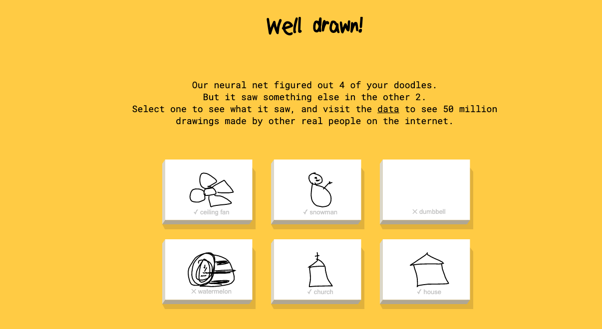

# DataYourself\#1.2: Tương tác với Thuật Toán

## Big Data

* Thuật toán, Machine Learning trở thành hot keywords trong những năm gần đây bởi sự bùng nổ của Data \(IoT\)
* Big Data trở thành một tài sản phi vật chất có giá chẳng kém vàng
* Data có 2 chiều để "Big"
  * Chiều Dọc \(n\): Số dòng \(hay số quan sát, số ví dụ, số users\)
  * Chiều Ngang \(p\): Số tính chất \(features\) được ghi nhận 

* **Big "n" and big "p":** Siêu máy tính \(GPU, TPU\) cho phép chúng ta xử lý một lượng dữ liệu lớn
* Manipulate "p": **Feature Engineering** 
  * Giảm p - "Less is more": Trong rất nhiều dữ liệu, làm sao ta biết dữ liệu nào quan trọng =&gt; **Feature Selection** 
  * Tăng p - Tạo ra thêm features từ các features 

* Manipulate "n": **Sampling Tech**
  * Giảm n - **Undersampling:** Trích xuất một mẫu nhỏ của data gốc, làm sao để đảm bảo mẫu nhỏ thể hiện đầy đủ các tính chất của mẫu 
  * Tăng n - **Synthetic sampling**: Tạo ra các điểm data "synthetic" từ các data gốc

## Thuật Toán

* **Thuật Toán:** Các tác vụ được lập trình theo bước \(để máy tính\) giải quyết một vấn đề/bài 
* **Machine Learning:** dạy "máy móc" như dạy một đứa =&gt; Học bằng ví dụ \(dữ liệu\)
* Dùng data trong quá khứ \(`X`\) để tạo ra một thuật toán hay phương trình: `f( )` nhằm tự động trả kết quả `(y_pred)` cho một dữ liệu đầu vào mới `(X')`
* Như thế nào?
  * **Data quá khứ:** `X` \(, quan sát được\) map với `y` \(nhãn, quan sát được\) =&gt; Rút ra quy luật: `f( )`
  * f\( \) có tính tổng quát: Đúng với cả data mới: `X'`, `y'` \(không có quan sát\)
  * **Predict:** `y_pred = f(X')`   

## Một số thuật toán thông 

### Finding Patterns

* Thuật toán: Clustering \(Unsupervisor \)
* Phân tách một nhóm quán sát lớn và rất khác  thành các nhóm nhỏ đồng đều hơn về tính 
* Như thế nào: 
  * Khoảng cách giữa hai điểm data \(chiều cao x cân nặng\)
* Ứng dụng:
  * Phân loại nhạc \(Thuật toán gợi ý\)
  * Phân loại users \(Ads Targeting\)

### Phân loại \(Classification\)

* **Decision Tree:** Thuật toán phân loại đơn giản nhất, chuỗi các câu hỏi YES/NO 

## Tương tác với Thuật 

## Dạng Data Đặc 

### Data Dạng Text 



Truy cập: [https://databasic.io/en/wordcounter](https://databasic.io/en/wordcounter)

* [ ] Input một đoạn text có chủ đề bạn quan tâm \(lyrics, news, wikipedia\)
* [ ] Bạn thấy gì từ kết quả?
* [ ] Bạn có thể download file CSV và phân tích thêm trên google 



* Bigrams: Cụm text 2 chữ
* CSV: comma-separate values file; định dạng phố biến để lưu data dạng bảng 
* Stopwords: những từ sẽ "ignore" trong text analysis, ví dụ "this", "that", "and", "but"
* Trigrams: Cụm text 3 chữ
* Word Cloud: Dạng minh hoạ với các từ, độ to nhỏ của từ phụ thuộc tần suất xuất 



### Đo độ giống nhau giữa 2 style viết lời 



Truy cập: [https://databasic.io/en/wordcounter](https://databasic.io/en/samediff/)

* [ ] Input một đoạn text có chủ đề bạn quan tâm \(lyrics, news, wikipedia\)
* [ ] Bạn thấy gì từ kết quả?



* Corpus: Một tập chữ. Ví dụ gom lại tất cả lời trong các ca khúc của Katy Perry
* Cosine Similarity: Một phép biến đổi, nhận hai "inputs" =&gt; So sánh sự giống nhau giữa hai chuỗi 



